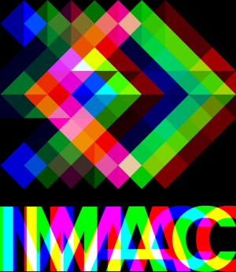
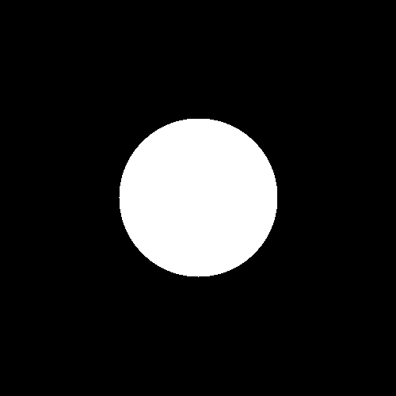
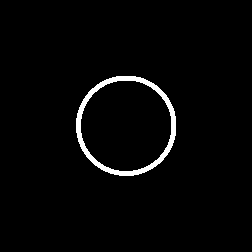
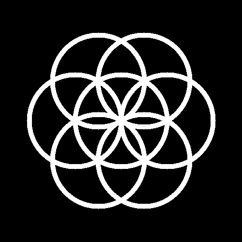
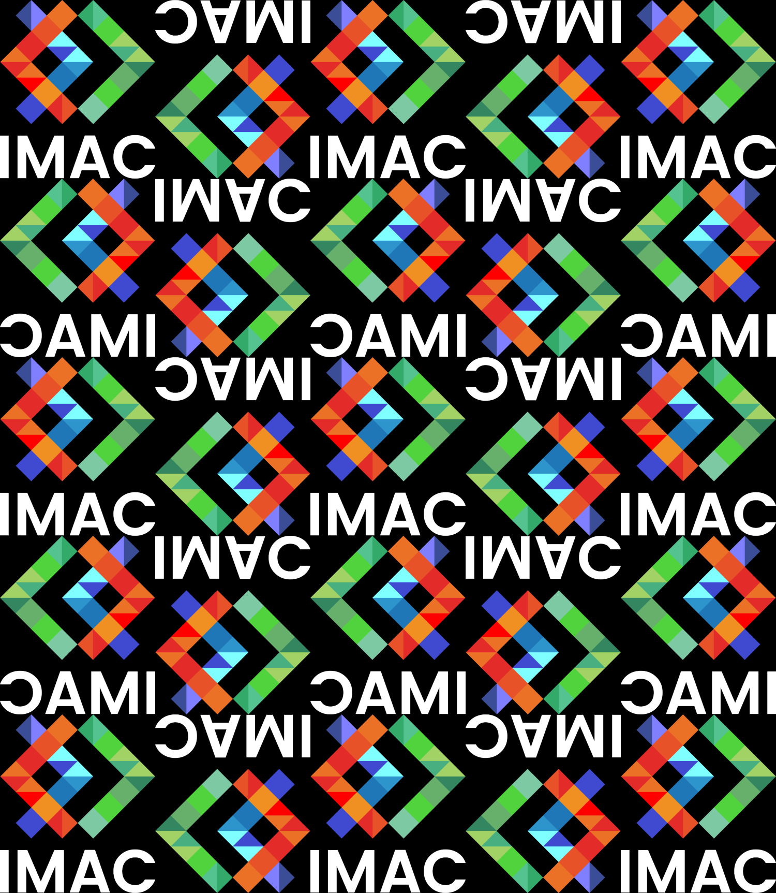
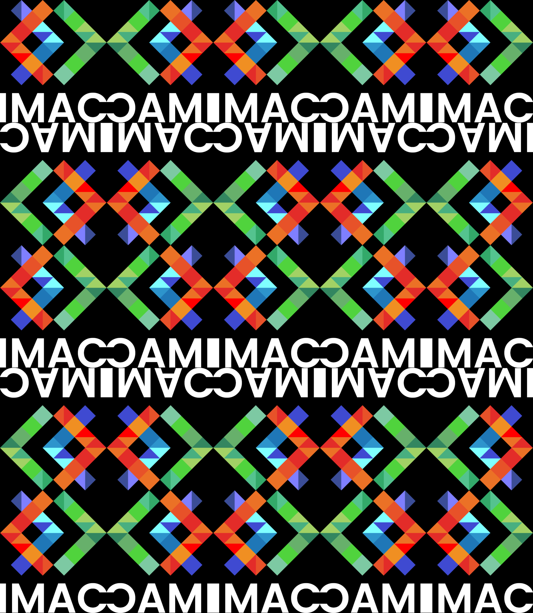
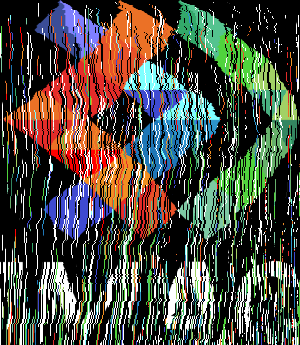
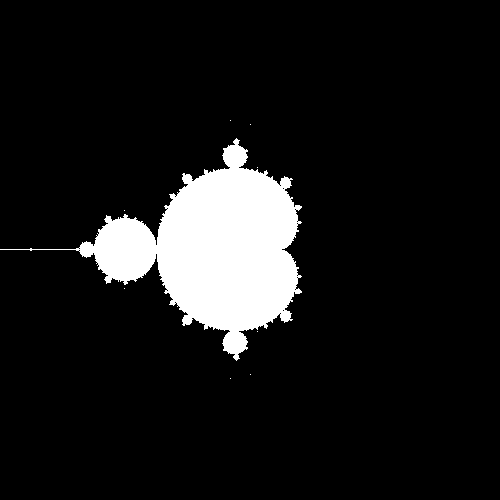
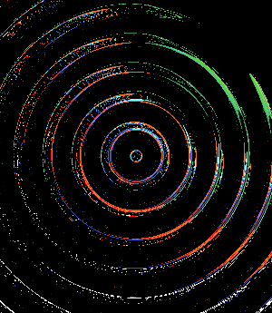
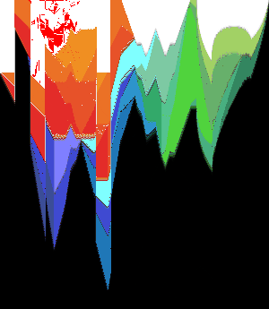

## Ne garder que le vert
| ||
| ------------- |-------------|

---
## Échanger les canaux
| ||
| ------------- |-------------|

---
## Noir & Blanc
| ||
| ------------- |-------------|

---
## Négatif
| ||
| ------------- |-------------|

---
## Dégradé


La découverte du calcul a demandé un certain temps, mais voici le résultat :
```cpp
float color = static_cast<float>(i) /(image.width()-1);
image.pixel(i, y) += color;
```
---

## Miroir
| ||
| ------------- |-------------|

Nous avons eu deux façons de faire :
```cpp
std::swap(image.pixel(i, y), image.pixel(image.width()-1-i, y));
```

Ou avec une fonction :
```cpp
int miroir = image.width()-x;
imageInverse.pixel(miroir, y) = image.pixel(x, y);
```

Autre effet "miroir" découvert avec ce code-ci :

```cpp
int miroir = image.width()-x;
glm::vec3 couleur = image.pixel(x, y);
image.pixel(miroir, y) = couleur;
```


---
## Image bruitée
| ||
| ------------- |-------------|

Pour cet effet, nous avons fait en sorte d'avoir des coordonnées de pixels `random`. Ensuite, nous avons fait de même pour chaque partie de la couleur du pixel en question.

---
## Rotation 90°
| ||
| ------------- |-------------|

Nous avons créé une nouvelle image en inversant les valeurs de `width` et de `height`. Puis nous avons recopié l'image à partir des bonnes coordonnées.

---
## RGB Split
| ||
| ------------- |-------------|

On ne sait pas trop comment expliquer, donc voici le code :
```cpp
sil::Image split{image.width(), image.height()};
    for(int i {0}; i<split.width(); i++){
        for(int j {0}; j<split.height(); j++){
            if(i<=30){
                split.pixel(i, j).g = image.pixel(i, j).g;
                split.pixel(i, j).b = image.pixel(i+30, j).b;
            }
            else if(i>=split.width()-31){
                split.pixel(i, j).r = image.pixel(i-30, j).r;
                split.pixel(i, j).g = image.pixel(i, j).g;
            }
            else {
                split.pixel(i, j).r = image.pixel(i-30, j).r;
                split.pixel(i, j).g = image.pixel(i, j).g;
                split.pixel(i, j).b = image.pixel(i+30, j).b;
            }
        }
    }
    split.save("output_l/rgb_split.png");
```

---
## Luminosité

|Image de référence |Après éclaircissement |Après assombrissement |
| ------------- |-------------| -----|
| | ||

Pour les deux images, nous avons utilisé la fonction `pow()` avec différentes valeurs de puissance.

---
## Disque


Dans le `if` pour colorer les bons pixels, nous avons utilisé :
```cpp
pow(i - image.width()/2, 2) + pow(j - image.height()/2, 2) <= pow(100, 2);
```

---
## Cercle


Nous avons utilisé deux fois le même `if` que pour le disque, avec des valeurs différentes.

---
## Rosace


Nous avons recréé une fonction `dessine_cercle`, que l'on a appelé plusieurs fois, pour dessiner les différents cercles de la rosace.

```cpp
sil::Image dessine_cercle(sil::Image& photo, int center_x, int center_y){
    int thickness {10};
    for (int i {0}; i<photo.width(); i++){
        for (int j {0}; j<photo.height(); j++){
            float const distance_carre { static_cast<float>(std::pow(i - center_x, 2) + std::pow(j - center_y, 2))};
            if (distance_carre <= std::pow(100, 2)){
                if (distance_carre >= std::pow(100-thickness, 2)){
                    photo.pixel(i, j) = glm::vec3{1};
                }
            }
        }
    }
    return photo;
}
```

---
## Mosaïque
| ||
| ------------- |-------------|

Nous avons créé une image noire de 5 fois la taille de l'image originale.
Puis avec une fonction `copie_image`, que nous avons appelé 25 fois dans deux boucles `for`, nous copions l'image originale dessus.

---
## Mosaïque miroir
|       |         |   |
| ------------- |-------------| -----|

Le début se passe de la même manière que la mosaïque normale. Cependant, nous avons créé 3 autres images avec les fonctions `al_envers` et `image_en_miroir`, afin de pouvoir ensuite les copier sur l'image finale.

La mosaïque intermédiaire obtenue était due à l'inversion dans les boucles des codes `copie_image(image, logo_a_miroir, k, j);` et `copie_image(image, logo_a_l_envers, k, j);`. Ceci est plus visible dans le code concerné.

---
## Glitch
| | |
| ------------- |-------------| -----|

Dû à des problèmes de coordonnées, nous avons obtenu le résultat intermédiaire ci-dessus, que nous avons nommé le "glitch fondant".

Pour le cas du glitch normal, nous avons demandé des coordonnées de rectangle avec `random_int()`. Puis dans ces coordonnées, nous avons aussi demandé des valeurs de couleur avec `random_float()`. Nous avons limité le nombre de glitch dans une boucle à 100.

---
## Fractale de Mandelbrot


Nous avons créé une boucle `while`, dans laquelle nous vérifions pour chaque pixel le calcul de `std::abs(z)` et `z=z*z+c`.

```cpp
while(std::abs(z)<=2 && iter<maxIter){
    z = z*z + c;
    iter++;
    image.pixel(i, j) = glm::vec3(1.f);
}
```

Puis en fonction du résultat de `iter`, nous colorons les pixels en noir ou en blanc.
Pour qu'il ait un degré différent de gris, nous avons effectué le calcul : `image.pixel(i, j) = glm::vec3(0.f + iter*0.02f);`.

---
## Vortex
| |
| ------------- |-------------|

Nous avons créé un effet de vortex sur une image en effectuant une rotation des pixels autour du centre de l'image. Il itère sur chaque pixel, calcule la distance au centre avec `glm::length(offset)`, utilise cette distance pour déterminer un angle de rotation, et applique ensuite une rotation à chaque pixel. Les coordonnées après rotation sont converties en entiers et clippées grâce à `glm::clamp` pour rester dans les limites de l'image. Enfin, la couleur du pixel après rotation est assignée au pixel d'origine dans l'image, produisant un effet de vortex. 

---
## Tramage
| | |
| ------------- |-------------|

L'effet de tramage a été obtenu en adaptant le code trouvé sur [cet article](https://medium.com/the-bkpt/dithered-shading-tutorial-29f57d06ac39).

Ce qui donne :
```cpp
void Dithering(sil::Image& image)
{
    const int bayer_n = 4;
    float bayer_matrix_4x4[][bayer_n] = {
    {    -0.5,       0,  -0.375,   0.125 },
    {    0.25,   -0.25,   0.375, - 0.125 },
    { -0.3125,  0.1875, -0.4375,  0.0625 },
    {  0.4375, -0.0625,  0.3125, -0.1875 },
    };

    for (int y{0}; y < image.height(); y++) 
    {
        for (int x{0}; x < image.width(); x++) 
        {
            float orig_color = image.pixel(x, y).r;
            float color_result = 0.f;
            float bayer_value = bayer_matrix_4x4[y % bayer_n][x % bayer_n];
            float output_color = orig_color + (2 * bayer_value);

            if (output_color > 0.5) 
            {
                color_result = 1.f;
            }

            glm::vec3 Color(color_result);
            image.pixel(x, y) = Color;
        }
    }
}
```

---
## Normalisation de l'histogramme
| ||
| ------------- |-------------|

Ce code normalise les valeurs des composantes rouge *r*, verte *g*, et bleue *b* de chaque pixel dans une image. Il parcourt l'image deux fois : la première fois pour déterminer les valeurs minimales et maximales de chaque composante, et la deuxième fois pour normaliser les valeurs des pixels en fonction de ces extrêmes. La normalisation est effectuée en ajustant les valeurs de chaque composante à une échelle entre 0 et 1 en utilisant la formule `(pixel_original - valeur_minimale) / (valeur_maximale - valeur_minimale)`.

---
## Convolution
|Original | Avec des boucles|Final|
| ------------- |-------------|-------------|
| |  ||

Après plusieurs essais avec des boucles, nous avons fini par trouver l'algorithme.
Notre problème se trouvait dans le calcul de la couleur des pixels à l'intérieur des quatres boucles `for`.
```cpp
couleur += logo.pixel(coordx, coordy)*kernel[i+static_cast<int>(kernel.size())/2][j+static_cast<int>(kernel[0].size())/2];
```
`coordx` et `coordy` correspondent aux coordonées permettant d'accéder au bon pixel en fonction des coordonnées de la matrice `kernel`. Les calculs dans les coordonnées de `kernel` sont effectués afin d'éviter de sortir de la matrice et donc d'avoir un problème.

---
## Netteté, contours, etc.
|Emboss|Outline|Sharpen|
| ------------- |-------------|-------------|
| |  ||

Les valeurs de la matrice `kernel` ont simplement été ajustées en fonction de l'effet demandé.
Voici les différentes matrices :
```cpp
std::vector<std::vector<float>> matrix_emboss {
        {-2.f, -1.f, 0.f},
        {-1.f, 1.f, 1.f},
        {0.f, 1.f, 2.f}
    };
std::vector<std::vector<float>> matrix_outline {
        {-1.f, -1.f, -1.f},
        {-1.f, 8.f, -1.f},
        {-1.f, -1.f, -1.f}
    };
std::vector<std::vector<float>> matrix_sharpen {
        {0.f, -1.f, 0.f},
        {-1.f, 5.f, -1.f},
        {0.f, -1.f, 0.f}
    };
```

---
## Tri de pixels
| ||
| ------------- |-------------|

Nous avons utilisé `image.pixels()` pour récupérer le tableau contenant tous les pixels de l'image et nous les avons triés avec `std::sort` par colonne selon la composante rouge de manière croissante. L'algorithme itère sur chaque colonne de l'image, extrait les pixels de la colonne dans un tableau, les trie en utilisant la composante rouge comme critère de tri, puis met à jour les pixels de la colonne dans l'image avec les pixels triés.